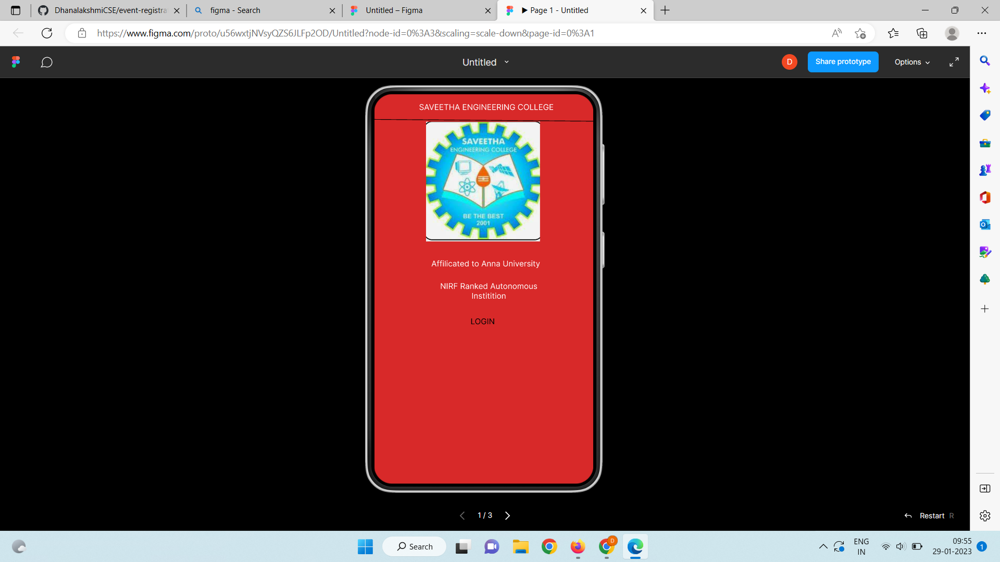
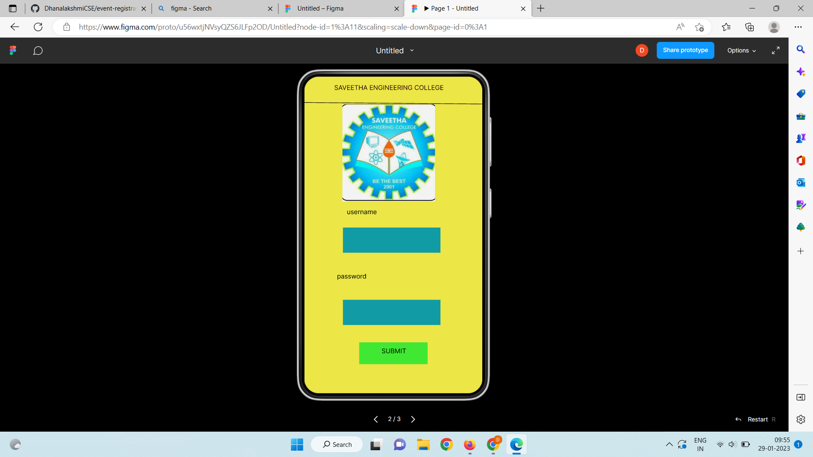
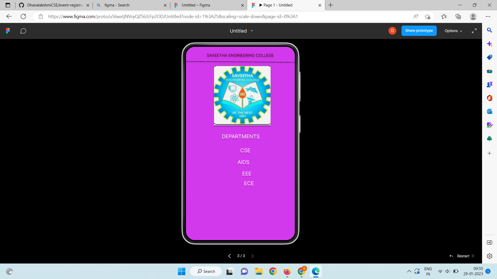

# Event Registration Web Application

## AIM:
To design, develop and deploy a web application for event registration.

## DESIGN STEPS:

### Step 1:
create a new frame.


### Step 2:
select any one present size of your choice

### Step 3:
select the shape you needed.

### Step 4:
Import images as needed .

### Step 5:
create pages based on your need and link there.

### Step 6:
Validate the HTML and CSS code.

### Step 6:
Publish the website in the given URL.

## DESIGN:
Figma

## code:
```position: relative;
width: 360px;
height: 640px;

background: #D82929;
box-shadow: 0px 4px 4px rgba(0, 0, 0, 0.25);


/* Login Page */


position: relative;
width: 360px;
height: 640px;

background: #ECE647;
box-shadow: 0px 4px 4px rgba(0, 0, 0, 0.25);


/* SAVEETHA ENGINEERING COLLEGE */


position: absolute;
width: 238px;
height: 29px;
left: 61px;
top: 20px;

font-family: 'Inter';
font-style: normal;
font-weight: 400;
font-size: 13px;
line-height: 16px;
text-align: center;

color: #2E0404;

text-shadow: 0px 4px 4px rgba(0, 0, 0, 0.25);


/* Line 3 */


position: absolute;
width: 364.01px;
height: 0px;
left: -4px;
top: 49px;

border: 1px solid #000000;
box-shadow: 0px 4px 4px rgba(0, 0, 0, 0.25);
transform: rotate(0.47deg);


/* logo 3 */


position: absolute;
width: 187px;
height: 197px;
left: 93px;
top: 63px;

background: url(logo.png);
filter: drop-shadow(0px 4px 4px rgba(0, 0, 0, 0.25));


/* DEPARTMENTS */


position: absolute;
width: 197px;
height: 46px;
left: 83px;
top: 286px;

font-family: 'Inter';
font-style: normal;
font-weight: 400;
font-size: 17px;
line-height: 21px;
text-align: center;

color: #FFFFFF;

text-shadow: 0px 4px 4px rgba(0, 0, 0, 0.25);


/* CSE */


position: absolute;
width: 125px;
height: 77px;
left: 134px;
top: 332px;

font-family: 'Inter';
font-style: normal;
font-weight: 400;
font-size: 17px;
line-height: 21px;
text-align: center;

color: #FFFFFF;

text-shadow: 0px 4px 4px rgba(0, 0, 0, 0.25);


/* AIDS */


position: absolute;
width: 89px;
height: 38px;
left: 146px;
top: 371px;

font-family: 'Inter';
font-style: normal;
font-weight: 400;
font-size: 17px;
line-height: 21px;
text-align: center;

color: #FFFFFF;

text-shadow: 0px 4px 4px rgba(0, 0, 0, 0.25);


/* EEE */


position: absolute;
width: 85px;
height: 42px;
left: 159px;
top: 409px;

font-family: 'Inter';
font-style: normal;
font-weight: 400;
font-size: 17px;
line-height: 21px;
text-align: center;

color: #FFFFFF;

text-shadow: 0px 4px 4px rgba(0, 0, 0, 0.25);


/* ECE */


position: absolute;
width: 85px;
height: 27px;
left: 166px;
top: 441px;

font-family: 'Inter';
font-style: normal;
font-weight: 400;
font-size: 17px;
line-height: 21px;
text-align: center;
color: #FFFFFF;
text-shadow: 0px 4px 4px rgba(0, 0, 0, 0.25);
```

## OUTPUT:





## Result:
The program to design .develope and display a web application for event registration is completed
successfully.

